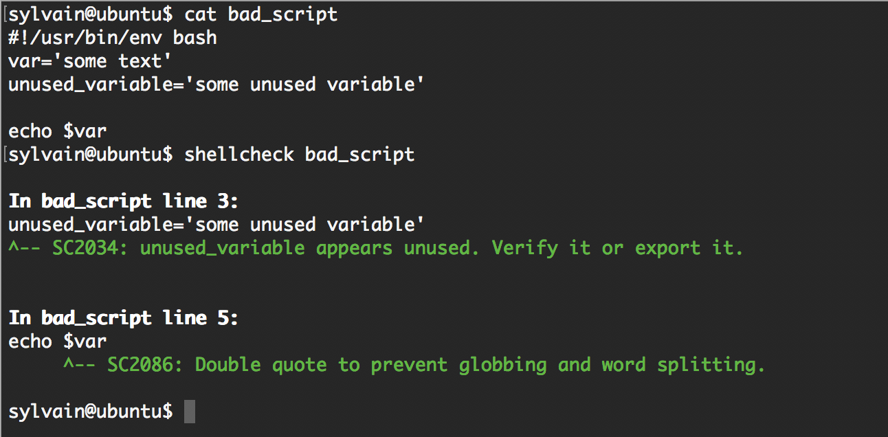

# **ALX SYSTEM ENGINNERING DEVOPS**
---
## Table of Contents
- [Author Details](#author-details)
- [Projects](#tasks)
	- [0. 0x00. Shell, basics](#0)
	- [1. 0x01. Shell, permissions](#1)
	- [2. 0x02. Shell, I/O Redirections and filters](#2)
	- [3. 0x03. Shell, init files, variables and expansions](#3)
	- [4. 0x04. Loops, conditions and parsing](#4)
	- [5. 0x05. Processes and signals](#5)
	- [6. 0x06. Regular expression](#6)
	- [7. 0x07. Networking basics #0](#7)
	- [8. 0x08. Networking basics #1](#8)
	- [9. 0x09. Web infrastructure design](#9)
	- [10. Attack is the best defense](#10)
	- [11. 0x0A. Configuration management](#11)
	- [12. 0x0B. SSH](#12)
	- [13. 0x0C. Web server](#13)
	- [14. 0x0D. Web stack debugging #0](#14)
	- [15. 0x0F. Load balancer](#15)
	- [16. 0x0E. Web stack debugging #1](#16)
	- [17. 0x10. HTTPS SSL](#17)
	- [18. ](#18)
	- [19. ](#19)
	- [20. ](#20)
---
## Author Details
- *Dean Robin Otsyeno - deanrobin777@gmail.com*

## Project
#### 0
###### [Table of Contents](#table-of-contents)
### [0. 0x00. Shell, basics](./0x00-shell_basics)
### General

- What does RTFM mean?
- What is a Shebang

### What is the Shell

- What is the shell
- What is the difference between a terminal and a shell
- What is the shell prompt
- How to use the history (the basics)

### Navigation

- What do the commands or built-ins `cd`, `pwd`, `ls` do
- How to navigate the filesystem
- What are the . and .. directories
- What is the working directory, how to print it and how to change it
- What is the root directory
- What is the home directory, and how to go there
- What is the difference between the root directory and the home directory of the user root
- What are the characteristics of hidden files and how to list them
- What does the command `cd -` do

### Looking Around

- What do the commands `ls`, `less`, `file` do
- How do you use options and arguments with commands
- Understand the ls long format and how to display it
- What does the `ln` command do
- What do you find in the most common/important directories
- What is a symbolic link
- What is a hard link
- What is the difference between a hard link and a symbolic link

### Manipulating Files

- What do the commands `cp`, `mv`, `rm`, `mkdir` do
- What are wildcards and how do they work
- How to use wildcards

### Working with Commands

- What do `type`, `which`, `help`, `man` commands do
- What are the different kinds of commands
- What is an alias
- When do you use the command help instead of man

### Reading Man Pages

- How to read a man page
- What are man page sections
- What are the section numbers for User commands, System calls and Library functions

### Keyboard Shortcuts for Bash

- Common shortcuts for Bash

### LTS

- What does `LTS` mean?
---
#### 1
###### [Table of Contents](#table-of-contents)
### [1. 0x01. Shell, permissions](./0x01-shell_permissions)
### Permissions

- What do the commands `chmod`, `sudo`, `su`, `chown`, `chgrp` do
- Linux file permissions
- How to represent each of the three sets of permissions (owner, group, and other) as a single digit
- How to change permissions, owner and group of a file
- Why can’t a normal user `chown` a file
- How to run a command with root privileges
- How to change user ID or become superuser

### Other Man Pages

- How to create a user
- How to create a group
- How to print real and effective user and group IDs
- How to print the groups a user is in
- How to print the effective userid

---
#### 2
###### [Table of Contents](#table-of-contents)
### [2. 0x02. Shell, I/O Redirections and filters](./0x02-shell_redirections)
### Shell, I/O Redirection

- What do the commands `head`, `tail`, `find`, `wc`, `sort`, `uniq`, `grep`, `tr` do
- How to redirect standard output to a file
- How to get standard input from a file instead of the keyboard
- How to send the output from one program to the input of another program
- How to combine commands and filters with redirections

### Special Characters

- What are special characters
- Understand what do the white spaces, single quotes, double quotes, backslash, comment, pipe, command separator, tilde and how and when to use them

### Other Man Pages

- How to display a line of text
- How to concatenate files and print on the standard output
- How to reverse a string
- How to remove sections from each line of files
- What is the `/etc/passwd` file and what is its format
- What is the `/etc/shadow` file and what is its format

---
#### 3
###### [Table of Contents](#table-of-contents)
### [3. 0x03. Shell, init files, variables and expansions](./0x03-shell_variables_expansions)
### General

- What happens when you type `$ ls -l *.txt`

### Shell Initialization Files

- What are the `/etc/profile` file and the `/etc/profile.d` directory
- What is the `~/.bashrc` file

### Variables

- What is the difference between a local and a global variable
- What is a reserved variable
- How to create, update and delete shell variables
- What are the roles of the following reserved variables: HOME, PATH, PS1
- What are special parameters
- What is the special parameter `$?`?

### Expansions

- What is expansion and how to use them
- What is the difference between single and double quotes and how to use them properly
- How to do command substitution with `$()` and backticks

### Shell Arithmetic

- How to perform arithmetic operations with the shell

### The `alias` Command

- How to create an alias
- How to list aliases
- How to temporarily disable an alias

### Other `help` pages

- How to execute commands from a file in the current shell

---
#### 4
###### [Table of Contents](#table-of-contents)
### [4. 0x04. Loops, conditions and parsing](./0x04-loops_conditions_and_parsing)
- How to create SSH keys
- What is the advantage of using `#!/usr/bin/env bash` over `#!/bin/bash`
- How to use `while`, `until` and `for` loops
- How to use `if`, `else`, `elif` and `case` condition statements
- How to use the `cut` command
- What are files and other comparison operators, and how to use them

## More Info

### Shellcheck

- [Shellcheck](https://github.com/koalaman/shellcheck "Shellcheck") is a tool that will help you write proper Bash scripts. It will make recommendations on your syntax and semantics and provide advice on edge cases that you might not have thought about. `Shellcheck` is your friend! **All your Bash scripts must pass `Shellcheck` without any error or you will not get any points on the task**.

- `Shellcheck` is available on the school’s computers. If you want to use it on your own computer, here is how to [install it](https://github.com/koalaman/shellcheck#installing "install it").

- Examples:

	- Not passing `Shellcheck`:  
<br/>

	- Passing `Shellcheck`:  
<br/>

- For every feedback, Shellcheck will provide a code that you can use to get more information about the issue, for example for code `SC2034`, you can browse [https://github.com/koalaman/shellcheck/wiki/SC2034](https://github.com/koalaman/shellcheck/wiki/SC2034 "https://github.com/koalaman/shellcheck/wiki/SC2034").

---
#### 5
###### [Table of Contents](#table-of-contents)
### [5. 0x05. Processes and signals](./0x05-processes_and_signals)
- What is a PID
- What is a process
- How to find a process’ PID
- How to kill a process
- What is a signal
- What are the 2 signals that cannot be ignored
    
## More Info

- For those who want to know more and learn about all signals, check out [this article](https://www.computerhope.com/unix/signals.htm "this article").

---
#### 6
###### [Table of Contents](#table-of-contents)
### [6. 0x06. Regular expression](./0x06-regular_expressions)
## Background Context

- For this project, you have to build your regular expression using Oniguruma, a regular expression library that which is used by Ruby by default. Note that other regular expression libraries sometimes have different properties.

- Because the focus of this exercise is to play with regular expressions (regex), here is the Ruby code that you should use, just replace the regexp part, meaning the code in between the `//`:

```
sylvain@ubuntu$ cat example.rb
#!/usr/bin/env ruby
puts ARGV[0].scan(/127.0.0.[0-9]/).join
sylvain@ubuntu$
sylvain@ubuntu$ ./example.rb 127.0.0.2
127.0.0.2
sylvain@ubuntu$ ./example.rb 127.0.0.1
127.0.0.1
sylvain@ubuntu$ ./example.rb 127.0.0.a
```

---
#### 7
###### [Table of Contents](#table-of-contents)
### [7. 0x07. Networking basics #0](./0x07-networking_basics)
### OSI Model

- What it is
- How many layers it has
- How it is organized

### What is a LAN

- Typical usage
- Typical geographical size

### What is a WAN

- Typical usage
- Typical geographical size

### What is the Internet

- What is an IP address
- What are the 2 types of IP address
- What is `localhost`
- What is a subnet
- Why IPv6 was created

### TCP/UDP

- What are the 2 mainly used data transfer protocols for IP (transfer level on the OSI schema)
- What is the main difference between TCP and UDP
- What is a port
- Memorize SSH, HTTP and HTTPS port numbers
- What tool/protocol is often used to check if a device is connected to a network

---
#### 8
###### [Table of Contents](#table-of-contents)
### [8. 0x08. Networking basics #1](./0x08-networking_basics_2)
- What is localhost/127.0.0.1
- What is 0.0.0.0
- What is `/etc/hosts`
- How to display your machine’s active network interfaces

---
#### 9
###### [Table of Contents](#table-of-contents)
### [9. 0x09. Web infrastructure design](./0x09-web_infrastructure_design)
- You are tasked to come up with solutions for the tasks below yourself to meet with the above learning objectives.
- You will not be able to meet the objectives of this or any following project by copying and pasting someone else’s work.
- You are not allowed to publish any content of this project.
- Any form of plagiarism is strictly forbidden and will result in removal from the program.

---
#### 10
###### [Table of Contents](#table-of-contents)
### [10. Attack is the best defense](./attack_is_the_best_defense)
**Optional**
- Network sniffing
- ARP spoofing
- Connect to SendGrid’s SMTP relay using telnet
- What is Docker and why is it popular?
- Dictionary attack

---
#### 11
###### [Table of Contents](#table-of-contents)
### [11. 0x0A. Configuration management](./0x0A-configuration_management)
- Intro to Configuration Management
- Puppet resource type: file (check “Resource types” for all manifest types in the left menu)
- Puppet’s Declarative Language: Modeling Instead of Scripting
- Puppet lint
- Puppet emacs mode

---
#### 12
###### [Table of Contents](#table-of-contents)
### [12. 0x0B. SSH](./0x0B-ssh)
- What is a server
- Where servers usually live
- What is SSH
- How to create an SSH RSA key pair
- How to connect to a remote host using an SSH RSA key pair
- The advantage of using `#!/usr/bin/env bash` instead of `/bin/bash`

**man or help**:

- `ssh`
- `ssh-keygen`
- `env`

---
#### 13
###### [Table of Contents](#table-of-contents)
### [13. 0x0C. Web server](./0x0C-web_server)
### General

- What is the main role of a web server
- What is a child process
- Why web servers usually have a parent process and child processes
- What are the main HTTP requests

### DNS

- What DNS stands for
- What is DNS main role

### DNS Record Types

- `A`
- `CNAME`
- `TXT`
- `MX`

---
#### 14
###### [Table of Contents](#table-of-contents)
### [14. 0x0D. Web stack debugging #0](./0x0D-web_stack_debugging_0)
- The Webstack debugging series will train you in the art of debugging. Computers and software rarely work the way we want (that’s the “fun” part of the job!).
- Being able to debug a webstack is essential for a Full-Stack Software Engineer, and it takes practice to be a master of it.
- In this debugging series, broken/bugged webstacks will be given to you, the final goal is to come up with a Bash script that once executed, will bring the webstack to a working state. But before writing this Bash script, you should figure out what is going on and fix it manually.

---
#### 15
###### [Table of Contents](#table-of-contents)
### [15. 0x0F. Load balancer](./0x0F-load_balancer)
- Let’s improve our web stack so that there is redundancy for our web servers. This will allow us to be able to accept more traffic by doubling the number of web servers, and to make our infrastructure more reliable. If one web server fails, we will still have a second one to handle requests.
- For this project, you will need to write Bash scripts to automate your work. All scripts must be designed to configure a brand new Ubuntu server to match the task requirements.

---
#### 16
###### [Table of Contents](#table-of-contents)
### [16. 0x0E. Web stack debugging #1](./0x0E-web_stack_debugging_1)
- Network basics

---
#### 17
###### [Table of Contents](#table-of-contents)
### [17. 0x10. HTTPS SSL](./0x10-https_ssl)
- What is HTTPS SSL 2 main roles
- What is the purpose encrypting traffic
- What SSL termination means

---
#### 18
###### [Table of Contents](#table-of-contents)
### [18. ](./)

---


<br></br>
<div align="right">
  <sub style="font-style: italic"> Dean Robin Otsyeno - deanrobin777@gmail.com</sub>
</div>
